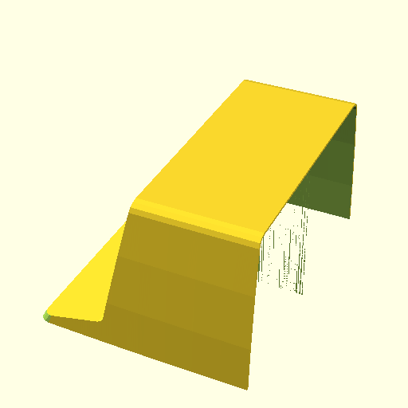

<!-- TODO add download link -->

# DEC VT52 Terminal

Scale model of the [DEC VT52 terminal](https://en.wikipedia.org/wiki/VT52), intended to be used with a [PiDP11](https://obsolescence.dev/pdp11).
Work in progress, not ready to print yet.

<!--  -->

## Design

The model is based on DEC technical drawings, [VT50 Field Maintenance Print Set](https://bitsavers.org/pdf/dec/terminal/vt50/VT50-print-set.pdf).
It is intended to be scaled down to 2/3, 3D printed in parts and assembled with a USB keyboard and an LCD panel.

The model uses [OpenSCAD](https://openscad.org/) with the [Belfry OpenScad Library, v2](https://github.com/BelfrySCAD/BOSL2/).

## Adjustments

In order to fit a real keyboard into a scaled model, and to replace the CRT screen with an LCD panel, some adjustments were made to the model:

Length of the keyboard area was adjusted. A 65% keyboard fits quite well side to side, but does not fit front to back.
In order to fit the keyboard, the model was extended forward by about 3 cm in the keyboard area and made about 6 mm taller.
This is implemented by extending the model into negative X and Y coordinates. This keeps coordinates for the rest of the model unchanged,
so it still mostly matches coordinates in the DEC drawings.

The keyboard is obviously oversized compared to a 2/3 scaled model, which makes the keyboard area look very different from the real terminal.
Features like the "DIGITAL decscope" logo had to be moved to a different location as well.

## Screen and Keyboard

This model is intended to be used with a 65% keyboard and an 8" LCD panel.

It is optimized for:
- Royal Kludge R65 65% Wired Gaming Keyboard (QMK/VIA)
  - The model just uses the insides of the keyboard, without the case or the volume knob.
  - I chose this keyboard mostly because I liked the key caps.
    It actually turned out to be a great keyboard.
  - You should be able to use a different 65% keyboard, but you will likely need to adjust the
    keyboard mounting features in keyboard.scad.
- Innolux 8 Inch IPS 1024*768 HJ080IA-01E Display Panel
  - You want a 4:3 8" panel with backlight that includes a driver board and supports HDMI input.
    They are quite easy to find on AliExpress and tend to cost about 40€ (2026).

I have no relation to these products or their manufacturers, they are just the keyboard and LCD panel I bought.
The model should be easy enough to adapt to a different keyboard or LCD panel.

## Artificial Intelligence Use

The model was mostly created by hand, since where's the fun in having AI do your hobby for you.

That said, there was some use of AI:
- I used Claude a few times to debug my geometric calculations, when I got completely lost in trigonometry.
- Claude was also used to read data tables from the scanned technical documentation (see body_tables.scad).
  Basically I used Claude to OCR the low quality scans, it's way too many numbers to copy them manually.
- Claude was used to improve the language in this document. I wrote it by hand first, but I am not a native speaker,
  trust me that you prefer to read the AI improved version.

Other than this, there was no use of AI when creating this model.

## License

License: [CC BY-SA](https://creativecommons.org/licenses/by-sa/4.0/)

The [DEV VT52 photo](https://raw.githubusercontent.com/matushorvath/vt52/assets/vt52-wikipedia.png)
was downloaded from [Wikipedia](https://en.wikipedia.org/wiki/File:Terminal-dec-vt52.jpg).
